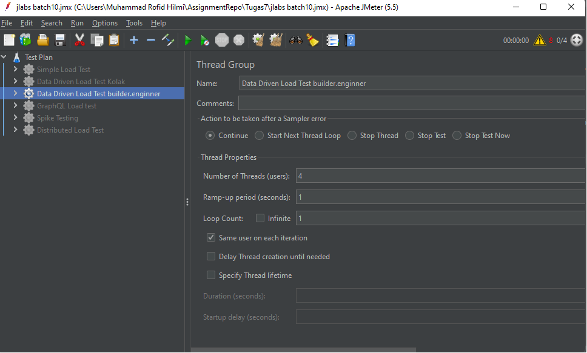

# MyAssignment QA Automation with Jakartalabs #Batch10
Halo, Repository ini dibuat untuk mengumpulkan tugas-tugas saya yang diberikan oleh tim Jakartalabs dan dapat menjadi sebuah fortofolio saya atas pengerjaan project ini.

# Cara Penggunaan Repo ini
Masuk ke folder /src -> main/java/com/testing/qa/JLabsAssignment atau dapat [klik disini](https://github.com/roofidhilmi/MyAssignmentQA-JLabs/tree/main/src/main/java/com/testing/qa/JLabsAssignment)

# Tugas Pertama - Java Basic
Pada tugas yang pertama ini membahas mengenai Jaca Fundamental dan tugas ini akan membahas penggunaan fungsi **TreeMap** dan **HashMap** pada Java

Pada tugas pertama ini dapat diakses di dalam folder berikut:

> Assignment1

# Tugas Kedua - Java OOP
Pada tugas yang kedua ini masih dalam pembahasan mengenai Java Fundamental seperti dasar-dasar OOP pada Java dan tugas kali ini pembuatan Kalkulator sederhana dengan mengimplementasikan statment try dan catch.

Pada tugas kedua ini dapat diakses di dalam folder berikut:

> Assignment2

# Tugas Ketiga - Web Automation with POM
Pada tugas yang ketiga ini membahas mengenai Web Automation dengan menggunakan selenium java, dan tugas kali ini membuat sebuah automation web yang dimana memiliki expected result melakukan cetak atau print sebuah isi pesan email yang dimana membutuhkan fungsi Switch Iframe.

Pada ketiga kedua ini dapat diakses di dalam folder berikut:

> Assignment3

Pada tugas kali ini juga telah menerapkan beberapa Best Practices seperti menggunakan Explicit Wait, Page Object Model (POM), Web Driver Management.

# Tugas Keempat - Web Automation with iframe
Pada pertemuan kali ini masih dalam pembahasan mengenai Web Automation, dimana tugas yang saya kerjakan ini adalah membuat automation web dengan flow input username & password untuk login, memilih produk dan menambahkannya kedalam keranjang belanja, melakukan checkout & pembayaran. 

Pada tugas kali ini telah menerapkan beberapa Best Practices seperti menggunakan Explicit Wait, Page Object Model (POM), Web Driver Mangement.

Pada tugas Keempat ini dapat diakses di dalam folder berikut:

> Assignment4

# Tugas Kelima - API Test Rest Assured with Java Faker
Pada pertemuan kali ini membahas API, dimana tugas yang saya kerjakan ini adalah membuat suatu atuomation API Test menggunakan Rest Assured, dengan melakukan pengetesan API Register menggunakan fungsi Faker untuk mendapatkan random nama, email, password dan lainnya, kemudian melakukan Assert get 200 Ok.

Pada tugas Kelima ini dapat diakses di dalam folder berikut:

> Assignment5/APITestAfterRefactor.java

# Tugas Keenam - Upload tugas ke Github
Pada pertemuan untuk tugas kali ini adalah pembahasan mengenai Git dan tugas yang saya kerjakan ini adalah membuat README.md pada repository Tugas saya.

# Tugas Ketujuh -Penggunaan Jmeter
Pada pertemuan ketujuh ini membahas mengenai penggunaan Jmeter dan tugas yang saya kerjakan ini adalah membuat:
1. Simple Load Test, 
2. Data Driven Load Test, 
3. GraphQL Load Test, 
4. Spike Load Test, 
5. Database Load Test.

Pada tugas Ketujuh ini dapat diakses di dalam folder berikut:

>Assignment7

